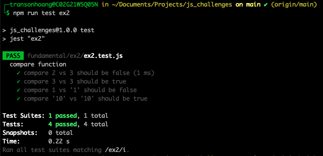

# Javascript Exercises

## Installation

- Clone Project

  ```bash
  git clone https://github.com/coderschoolmentee/js_challenges.git
  ```

- Go to the folder

  ```bash
  cd js_challenges
  ```

- Install the libraries

  ```bash
  npm i
  ```

## Tech Stacks

- Javascript
- Jest

## How to use

- Write the code on the `.js` file
- Run command `npm run test filename` to check the code

  ```bash
  npm run test ex1
  ```

  
